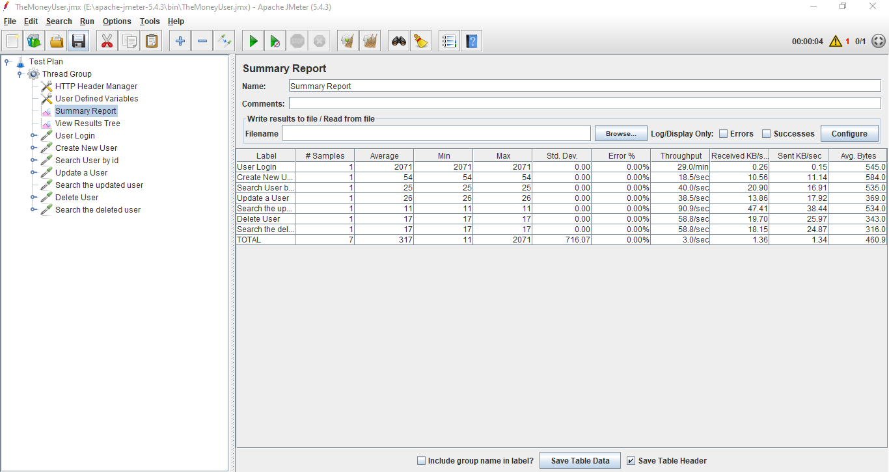
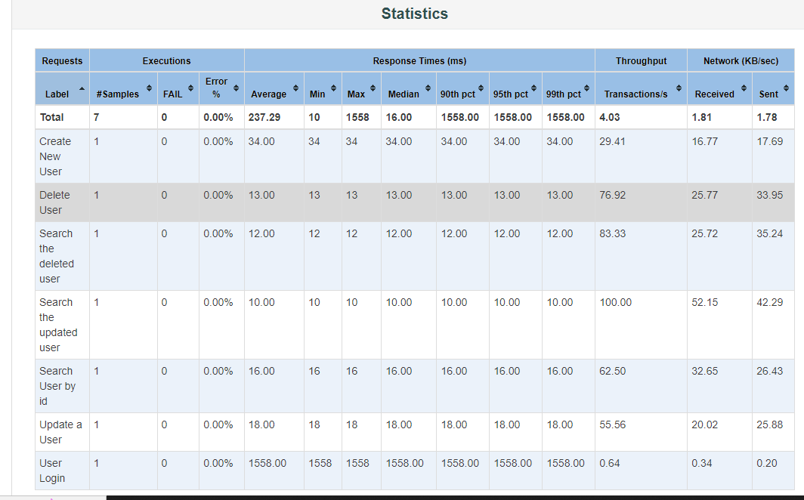

# dmoney-user-jmeter
# Dmoney User API in Jmeter

- [API](http://dmoney.professionaltrainingbd.com/)

### **How to run this project**

## **Clone From**:

```
 https://github.com/tanvirmitul/dmoney-user-jmeter/tree/main
```

- Move jmx file into \apache-jmeter-5.5\bin path
- Open in windows terminal or git bash terminal and run below command

```
jmeter -n -t TheMoneyUser.jmx -l TheMoneyUser.csv -e -o Reports
```
## Steps
- Create user
- Search user
- Update user by id
- Delete user





